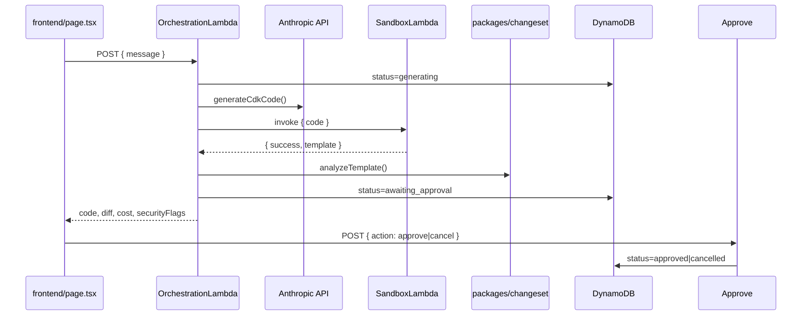
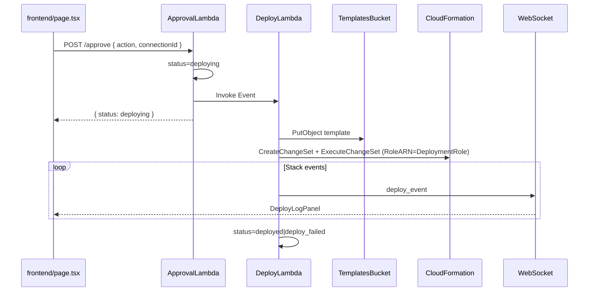

# Code Guide — Important Parts of the Apex Codebase

This document explains the most important code paths for **Week 2 / Day 14** of the DevOps Copilot PRD. Each section references the exact file and line numbers.

For product requirements see [`context.md`](context.md). For implementation status see [`progress.md`](progress.md).

---

## 1. End-to-end request flow

---

## 2. CDK stacks — infrastructure wiring

### Entry point — [`infra/bin/infra.ts`](infra/bin/infra.ts)

| Lines | What it does |
|-------|--------------|
| 8–11 | Sets deploy env: `CDK_DEFAULT_ACCOUNT` + hardcoded `ap-south-1` |
| 13–17 | Creates `SandboxStack` first, passes `sandboxFn` into `InfraStack` |

### Main stack — [`infra/lib/infra-stack.ts`](infra/lib/infra-stack.ts)

| Lines | What it does |
|-------|--------------|
| 22–33 | **DynamoDB `GenerationsTable`** — composite key `conversationId` + `generationId`, on-demand billing |
| 50–64 | **OrchestrationLambda** — 120s timeout, bundles changeset analyzer, env vars for sandbox + DynamoDB + Secrets Manager |
| 66–75 | **ApprovalLambda** — reads/writes DynamoDB for approve/cancel |
| 103–111 | **Orchestration Function URL** — 120s timeout (frontend uses this instead of API Gateway for generation) |
| 124–131 | **API routes** — `POST /generate` (legacy), `POST /orchestrate`, `POST /approve` |
| 137–141 | **CDK output `OrchestrationFunctionUrl`** — copy this into `frontend/.env.local` |

### Sandbox stack — [`infra/lib/sandbox-stack.ts`](infra/lib/sandbox-stack.ts)

| Lines | What it does |
|-------|--------------|
| 29–31 | **LayerVersion** — prebuilt CDK deps from `infra/lambda/sandbox-layer/` |
| 34–50 | **Restrictive IAM** — only CloudWatch log write permissions (no AWS API access) |
| 52–81 | **SandboxLambda** — 1024MB, 60s, local bundling via `tryBundle` (no Docker required) |

---

## 3. Orchestration pipeline — the Day 12–14 core

### [`infra/lambda/orchestrate/index.ts`](infra/lambda/orchestrate/index.ts)

| Lines | What it does |
|-------|--------------|
| 11–24 | **Request schema** — accepts `{ message }` or `{ request }`, auto-generates UUIDs |
| 33–38 | **Status enum** — `generating` → `awaiting_approval` → `approved` / `cancelled` / `failed` |
| 123–142 | **`invokeSandbox()`** — synchronous Lambda invoke of sandbox with `{ code }` payload |
| 153–166 | **Step 1** — write initial DynamoDB record with `status: generating` |
| 168–175 | **Step 2–3** — call Claude, invoke sandbox, fail if synth errors |
| 177–189 | **Step 4** — run `analyzeTemplate()` for changeset + cost + security |
| 191–207 | **Step 5** — persist final state + return flattened response including `diff` |
| 209–216 | **Error path** — catch all errors, write `status: failed` to DynamoDB |

The handler factory `createOrchestrationHandler()` (line 144) is injectable for unit tests in [`infra/test/orchestration.test.ts`](infra/test/orchestration.test.ts).

---

## 4. Approval flow

### [`infra/lambda/approve/index.ts`](infra/lambda/approve/index.ts)

| Lines | What it does |
|-------|--------------|
| 5–9 | **Input** — `{ conversationId, generationId, action: 'approve' \| 'cancel' }` |
| 95–111 | **Validation** — 404 if not found, 409 if not in `awaiting_approval` |
| 113–119 | **State transition** — `approve` → `approved`, `cancel` → `cancelled` |
| 121–128 | **Response** — returns updated item from DynamoDB |

Wired to **`POST /approve`** on API Gateway in [`infra/lib/infra-stack.ts`](infra/lib/infra-stack.ts) lines 129–131.

---

## 5. AI code generation

### Shared prompt module — [`infra/lambda/shared/prompt.ts`](infra/lambda/shared/prompt.ts)

| Lines | What it does |
|-------|--------------|
| 4–7 | **Zod schema** — validates Claude returns `{ code, explanation }` |
| 11–23 | **System prompt** — enforces JSON-only output, least-privilege IAM, encryption rules |
| 27–30 | **Retry detection** — 429 rate limit and 529 overload |
| 40–58 | **`createMessageWithRetry()`** — 3 attempts, exponential backoff (250ms × 2^n) |
| 61–78 | **`generateCdkCode()`** — calls `claude-sonnet-4-6`, parses + validates JSON |

### API key caching — [`infra/lambda/shared/anthropicApiKey.ts`](infra/lambda/shared/anthropicApiKey.ts)

| Lines | What it does |
|-------|--------------|
| 3 | Module-level cache — survives warm Lambda invocations |
| 12–15 | Reads `ANTHROPIC_API_KEY_SECRET_ARN` from env |
| 17–25 | Fetches from Secrets Manager once, caches for container lifetime |

---

## 6. Sandbox — isolated CDK synth

### [`infra/lambda/sandbox/index.ts`](infra/lambda/sandbox/index.ts)

| Lines | What it does |
|-------|--------------|
| 23–36 | **Fake AWS env** — `CDK_DEFAULT_ACCOUNT=000000000000`, region `ap-south-1`; uses layer's `node_modules` via symlink |
| 56–81 | **`writeWorkspaceFiles()`** — writes `app.ts`, symlinks layer deps, minimal `tsconfig.json` |
| 96–103 | **Input validation** — requires `{ code: string }` |
| 105 | **`mkdtempSync`** — isolated temp dir under `/tmp` |
| 110–120 | **`cdk synth`** — 50s timeout, reads first `*.template.json` from `cdk.out/` |
| 136–138 | **`finally`** — always deletes temp dir |

### Layer build — [`scripts/build-sandbox-layer.sh`](scripts/build-sandbox-layer.sh)

Pins `aws-cdk-lib@2.170.0`, `constructs@10.4.2`, `ts-node@10.9.2`, `typescript@5.4.5` into `infra/lambda/sandbox-layer/nodejs/`.

---

## 7. Changeset analysis — diff, cost, security

### Analyzer entry — [`packages/changeset/src/analyzer.ts`](packages/changeset/src/analyzer.ts)

| Lines | What it does |
|-------|--------------|
| 25–38 | **`analyzeTemplate()`** — orchestrates parse → cost → security, all Zod-validated |

### Parser — [`packages/changeset/src/parser.ts`](packages/changeset/src/parser.ts)

Compares current vs previous CloudFormation template. Without a previous template, every resource is `action: 'create'`.

### Diff renderer — [`packages/changeset/src/diffRenderer.ts`](packages/changeset/src/diffRenderer.ts)

| Lines | What it does |
|-------|--------------|
| 3–7 | **Color map** — green=create, blue=modify, red=delete |
| 9–20 | **`buildDiffRenderModel()`** — produces summary like *"2 new resources, 0 existing, 0 deletions"* |

### Cost estimator — [`packages/changeset/src/costEstimator.ts`](packages/changeset/src/costEstimator.ts)

| Lines | What it does |
|-------|--------------|
| 20–26 | **Service code map** — Lambda, DynamoDB, S3, API Gateway |
| 35–56 | **Heuristic fallbacks** — when Pricing API lookup fails |
| 58+ | **`CostEstimator` class** — uses `@aws-sdk/client-pricing` with in-memory cache |

### Security scanner — [`packages/changeset/src/securityScanner.ts`](packages/changeset/src/securityScanner.ts)

| Lines | What it does |
|-------|--------------|
| 58–76 | **IAM wildcards** — flags `Action: '*'` and `Resource: '*'` |
| 78–94 | **S3** — public access block + encryption checks |
| 96–115 | **RDS** — storage encryption checks |
| 117–133 | **EC2 Security Groups** — flags inbound `0.0.0.0/0` |

---

## 8. Frontend

### Main page — [`frontend/src/app/page.tsx`](frontend/src/app/page.tsx)

| Lines | What it does |
|-------|--------------|
| 29–37 | **URL helpers** — reads `NEXT_PUBLIC_ORCHESTRATION_URL` and `NEXT_PUBLIC_API_GATEWAY_URL` |
| 152–198 | **`submitApproval()`** — POST to `/approve` with conversation + generation IDs |
| 200–280 | **`handleGenerate()`** — POST `{ message }` to orchestration Function URL |
| 528–543 | **Preview panels** — DiffPanel, CostEstimatePanel, SecurityFlagsPanel + ApprovalBar |

### UI components

| File | Purpose |
|------|---------|
| [`frontend/src/components/DiffPanel.tsx`](frontend/src/components/DiffPanel.tsx) | Colour-coded resource list (green/blue/red borders) |
| [`frontend/src/components/CostEstimatePanel.tsx`](frontend/src/components/CostEstimatePanel.tsx) | Monthly cost total + per-resource breakdown |
| [`frontend/src/components/SecurityFlagsPanel.tsx`](frontend/src/components/SecurityFlagsPanel.tsx) | High/medium severity security warnings |
| [`frontend/src/components/ApprovalBar.tsx`](frontend/src/components/ApprovalBar.tsx) | Approve / Cancel buttons when `status === awaiting_approval` |
| [`frontend/src/components/CodeHighlight.tsx`](frontend/src/components/CodeHighlight.tsx) | Syntax-highlighted CDK code display |

### Types — [`frontend/src/lib/types.ts`](frontend/src/lib/types.ts)

Shared TypeScript interfaces for `GenerationItem`, `DiffRenderModel`, `CostEstimate`, `SecurityFlag`, and `OrchestrationResponse`.

---

## 9. Tests worth knowing

| File | What it verifies |
|------|------------------|
| [`infra/test/orchestration.test.ts`](infra/test/orchestration.test.ts) | Full pipeline: generate → sandbox → analyze → DynamoDB → response shape |
| [`infra/test/approval.test.ts`](infra/test/approval.test.ts) | Approve and cancel state transitions |
| [`infra/test/orchestration-infra.test.ts`](infra/test/orchestration-infra.test.ts) | CDK template has DynamoDB table + IAM permissions |
| [`packages/changeset/test/securityScanner.test.ts`](packages/changeset/test/securityScanner.test.ts) | IAM wildcards, S3, security group checks |

---

## 10. Environment variables

### Lambda (set by CDK)

| Variable | Set on | Purpose |
|----------|--------|---------|
| `ANTHROPIC_API_KEY_SECRET_ARN` | OrchestrationLambda | Secrets Manager secret for Claude API key |
| `SANDBOX_FUNCTION_NAME` | OrchestrationLambda, GenerateLambda | Target for sandbox invoke |
| `GENERATIONS_TABLE_NAME` | OrchestrationLambda, ApprovalLambda | DynamoDB table name |

### Frontend (set in `.env.local`)

| Variable | Purpose |
|----------|---------|
| `NEXT_PUBLIC_ORCHESTRATION_URL` | Orchestration Function URL (120s) — **required for Generate** |
| `NEXT_PUBLIC_API_GATEWAY_URL` | API Gateway base URL — **required for Approve/Cancel** |

See [`frontend/.env.example`](frontend/.env.example).

---

## 11. Legacy vs current path

| Path | Endpoint | Status |
|------|----------|--------|
| **Current (Day 14)** | Orchestration Function URL | Full pipeline with diff/cost/security/approval |
| **Legacy** | Generate Function URL / `POST /generate` | Claude + sandbox synth only, no analysis or DynamoDB |

The frontend now uses the orchestration path exclusively (see [`frontend/src/app/page.tsx`](frontend/src/app/page.tsx) line 200+).

---

## 12. Deploy pipeline (Phase 4 / Week 4)

| File | Role |
|------|------|
| [`infra/lambda/shared/generation.ts`](infra/lambda/shared/generation.ts) | Shared statuses + DynamoDB get/put + stack name helper |
| [`infra/lambda/deploy/index.ts`](infra/lambda/deploy/index.ts) | CFN change-set lifecycle, event polling, failure/rollback recording |
| [`infra/lambda/approve/index.ts`](infra/lambda/approve/index.ts) | `awaiting_approval`/`deploy_failed` → `deploying` + async invoke |
| [`infra/lambda/shared/pipelineStream.ts`](infra/lambda/shared/pipelineStream.ts) | `pipeline_step` + `deploy_event` emitters |
| [`infra/lib/infra-stack.ts`](infra/lib/infra-stack.ts) | `TemplatesBucket`, `DeploymentRole`, `DeployLambda`, grants/outputs |
| [`frontend/src/components/DeployLogPanel.tsx`](frontend/src/components/DeployLogPanel.tsx) | xterm live log |
| [`frontend/src/components/DeploymentOutputsPanel.tsx`](frontend/src/components/DeploymentOutputsPanel.tsx) | Outputs + console link |
| [`frontend/src/lib/deploy.ts`](frontend/src/lib/deploy.ts) | Client helpers for deploy events/URLs |

Stack naming: `apex-gen-<generationId-first-8>`. Templates: `templates/<generationId>.template.json`.

Tests: [`infra/test/deploy.test.ts`](infra/test/deploy.test.ts), [`infra/test/deploy-infra.test.ts`](infra/test/deploy-infra.test.ts), updated [`infra/test/approval.test.ts`](infra/test/approval.test.ts).

---

## 13. What's intentionally deferred

- Cognito / JWT auth (Phase 4 optional stretch; keep `ENABLE_COGNITO` off)
- Cross-account/region deploys, Slack bot, GitHub Actions (post-launch)
