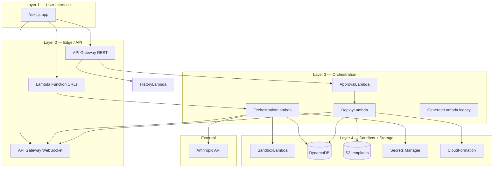

# Apex — architecture layers

Apex has **four layers** (from the PRD). Each layer has a single job; together they turn English into live AWS infrastructure.



---

## Layer 1 — User Interface

**What it is:** Next.js 15 app in [`frontend/`](../frontend/).

**Your job as a user:** Type infrastructure requests, review code, diff, cost, security, approve deploy, watch logs.

| Piece | File | Purpose |
|-------|------|---------|
| Main workspace | `frontend/src/app/page.tsx` | Chat, history, generate, approve |
| Code view | `frontend/src/components/CodeHighlight.tsx` | Syntax-highlighted CDK |
| Diff / cost / security | `DiffPanel`, `CostEstimatePanel`, `SecurityFlagsPanel` | F3 preview |
| Pipeline steps | `PipelineSteps.tsx` | Live orchestration progress |
| Deploy terminal | `DeployLogPanel.tsx` | CloudFormation events (F4) |
| Outputs | `DeploymentOutputsPanel.tsx` | Stack outputs + console link |
| WebSocket hook | `hooks/usePipelineWebSocket.ts` | `pipeline_step` + `deploy_event` |

**Env vars:** `NEXT_PUBLIC_ORCHESTRATION_URL`, `NEXT_PUBLIC_API_GATEWAY_URL`, `NEXT_PUBLIC_WEBSOCKET_URL`

**Does not:** Call Claude directly, run CDK, or touch AWS APIs (except via your backend URLs).

---

## Layer 2 — Edge / API

**What it is:** How the browser reaches Lambdas.

| Entry | Timeout | Routes / use |
|-------|---------|--------------|
| **Orchestration Function URL** | 120s | `POST` generate (full pipeline) — **primary** |
| **API Gateway REST** | 29s | `POST /approve`, `GET /history`, legacy `/generate` |
| **WebSocket API** | Persistent | Connect → receive `connected` + stream events |

**CDK:** [`infra/lib/infra-stack.ts`](../infra/lib/infra-stack.ts)

**Important:** Use **Function URL** for generation (not REST `/orchestrate`) — orchestration can exceed 29s.

**Does not:** Run business logic — only routes and auth (none in v1; Cognito deferred).

---

## Layer 3 — Orchestration

**What it is:** Lambda functions that drive the workflow.

### OrchestrationLambda — the brain

Path: [`infra/lambda/orchestrate/index.ts`](../infra/lambda/orchestrate/index.ts)

```text
1. Write DynamoDB status: generating
2. Call Claude (Anthropic API) → CDK code
3. Invoke SandboxLambda → CloudFormation template
4. Analyze template → changeset, cost, security
5. Write DynamoDB status: awaiting_approval
6. Stream pipeline_step events over WebSocket
```

### ApprovalLambda — human gate

Path: [`infra/lambda/approve/index.ts`](../infra/lambda/approve/index.ts)

- **approve** → `deploying` + async invoke DeployLambda  
- **cancel** → `cancelled`

### DeployLambda — real AWS deploy (Phase 4)

Path: [`infra/lambda/deploy/index.ts`](../infra/lambda/deploy/index.ts)

```text
1. Upload template to S3
2. CloudFormation CreateChangeSet + ExecuteChangeSet
3. Poll stack events → deploy_event on WebSocket
4. Write deployed | deploy_failed + outputs to DynamoDB
```

Uses **DeploymentRole** (not the Lambda’s own role) so CFN runs with a tight allowlist.

### GenerateLambda — legacy

Path: [`infra/lambda/generate/index.ts`](../infra/lambda/generate/index.ts)

Older path: Claude + sandbox only, no DynamoDB/analysis. Frontend uses orchestration instead.

---

## Layer 4 — Sandbox + Storage

**What it is:** Isolated execution and persistence.

### SandboxLambda + SandboxStack

- **Zero production AWS API access** (logs only)
- Runs `cdk synth` in `/tmp` using pinned CDK from Lambda layer
- Returns `{ success, template }` or error

Files: [`infra/lambda/sandbox/`](../infra/lambda/sandbox/), [`infra/lib/sandbox-stack.ts`](../infra/lib/sandbox-stack.ts)

### DynamoDB — GenerationsTable

- Key: `conversationId` + `generationId`
- Stores: code, template, changeset, cost, security flags, status, deploy fields

### S3 — TemplatesBucket

- Stores synthesized templates for CloudFormation `TemplateURL`

### Secrets Manager

- Secret `anthropic-api-key` — fetched once per warm Lambda container

### CloudFormation

- Stacks named `apex-gen-<first-8-of-generationId>`
- Assumes **DeploymentRole** (S3-focused allowlist for demo)

---

## External — AI layer

**Not in AWS:** Anthropic API (`claude-sonnet-4-6`)

- SDK: `@anthropic-ai/sdk`
- Prompt + retry: [`infra/lambda/shared/prompt.ts`](../infra/lambda/shared/prompt.ts)
- Output validated with **Zod** before sandbox runs

---

## Status machine (whole system)

```text
generating → awaiting_approval → deploying → deployed
                               → cancelled           → deploy_failed
           → failed
```

---

## Shared libraries

| Package | Role |
|---------|------|
| [`packages/changeset/`](../packages/changeset/) | Parse CFN template → diff, cost estimate, security scan |
| [`infra/lambda/shared/generation.ts`](../infra/lambda/shared/generation.ts) | Zod schema for DynamoDB records |
| [`infra/lambda/shared/pipelineStream.ts`](../infra/lambda/shared/pipelineStream.ts) | WebSocket message types + emit helpers |

---

## Where to go next

| Doc | Content |
|-----|---------|
| [VERIFICATION.md](./VERIFICATION.md) | Step-by-step “is it working?” |
| [phases/README.md](./phases/README.md) | Phase-by-phase build history |
| [architecture.md](./architecture.md) | Deploy path detail |
| [CODE_GUIDE.md](../CODE_GUIDE.md) | Line-by-line code map |
