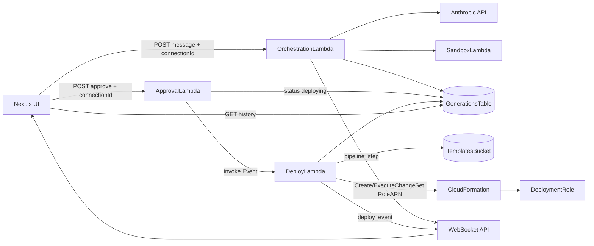

# Apex architecture

Region: **ap-south-1**. Stacks: `SandboxStack` (synth sandbox) → `InfraStack` (API, orchestration, deploy, UI backends).

## High-level



## Generation status machine

```text
generating → awaiting_approval → deploying → deployed
                               ↘ cancelled           ↘ deploy_failed
           → failed
```

`approved` remains in the schema for backward compatibility; the live approve path transitions straight to `deploying`.

## Deploy path (Phase 4)

1. User approves a generation in `awaiting_approval` (or retries from `deploy_failed`).
2. `ApprovalLambda` writes `status: deploying` and async-invokes `DeployLambda` (`InvocationType: Event`).
3. `DeployLambda`:
   - Uploads `cloudFormationTemplate` to `s3://TemplatesBucket/templates/<generationId>.template.json`
   - Creates a change set (`CREATE` or `UPDATE`) with `RoleARN = DeploymentRole`
   - Executes the change set and polls `DescribeStackEvents`
   - Streams each new event as WebSocket `deploy_event`
   - Writes terminal status + `deploymentOutputs` / `deploymentError` to DynamoDB
4. UI renders logs in `DeployLogPanel` and outputs in `DeploymentOutputsPanel`.

## Key resources

| Resource | Purpose |
|----------|---------|
| `GenerationsTable` | Conversation/generation state (schemaless extras for deploy fields) |
| `TemplatesBucket` | Encrypted, private S3 for CFN templates |
| `DeploymentRole` | Assumed by CloudFormation; S3-allowlisted for demo safety |
| `DeployLambda` | 15 min timeout; owns CFN lifecycle |
| `PipelineWebSocketApi` | Shared socket for `pipeline_step` and `deploy_event` |

## IAM boundary

- **DeployLambda** may `iam:PassRole` only to `DeploymentRole`, and may manage stacks named `apex-gen-*`.
- **DeploymentRole** is the guardrail against LLM-generated templates creating arbitrary AWS resources (starts with S3 only).

## Frontend surfaces

| Component / hook | Role |
|------------------|------|
| `usePipelineWebSocket` | `pipeline_step` + `deploy_event` |
| `DeployLogPanel` | xterm live CFN log |
| `DeploymentOutputsPanel` | Outputs + console deep link |
| `ApprovalBar` | Approve / Deploying / Deployed / Retry |
